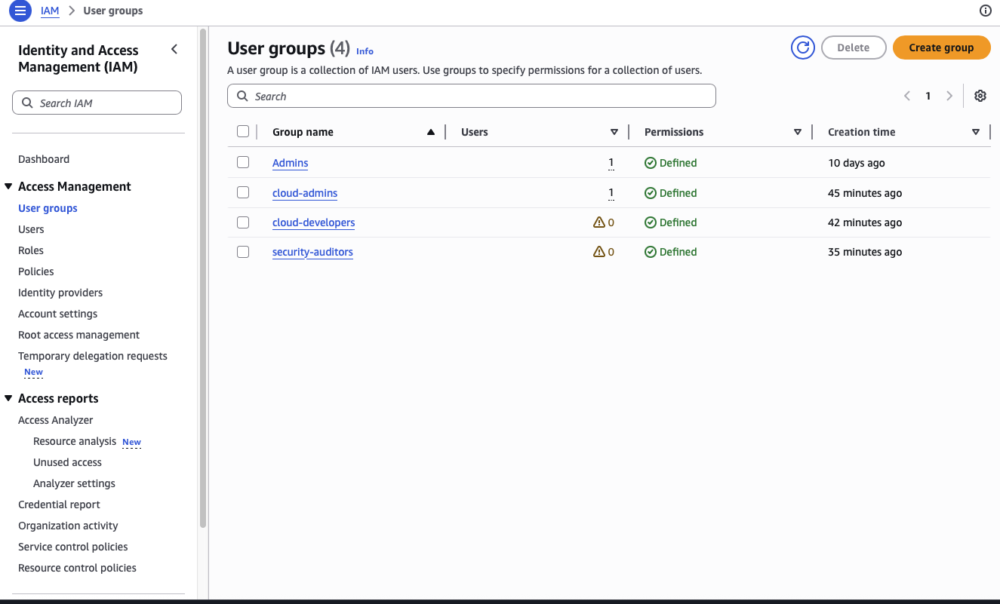
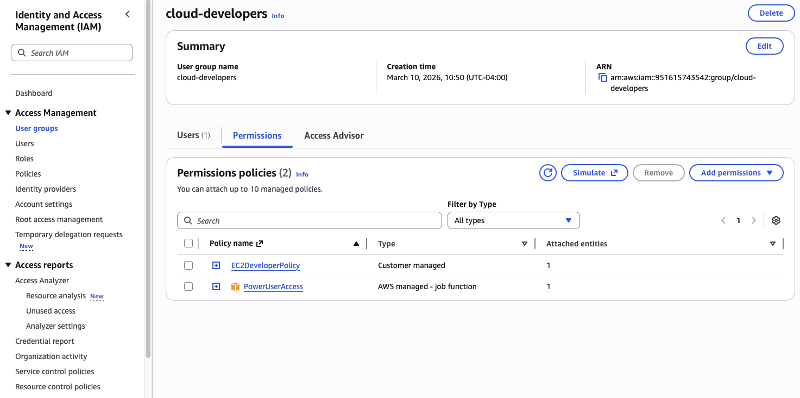
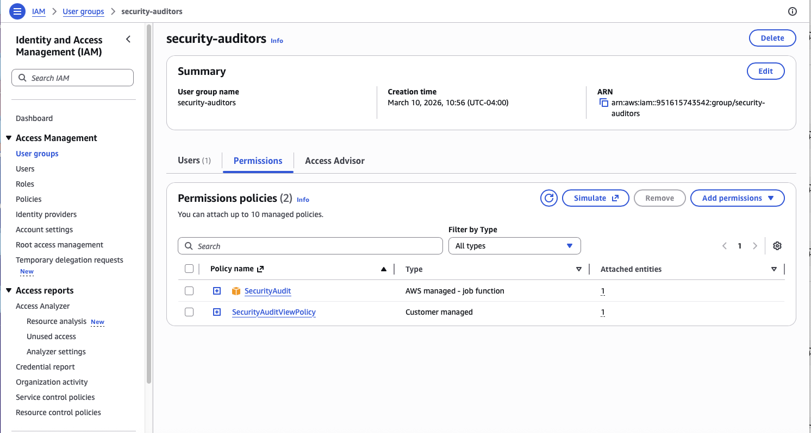
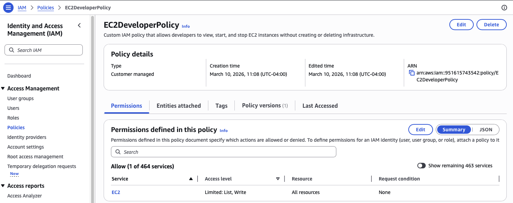
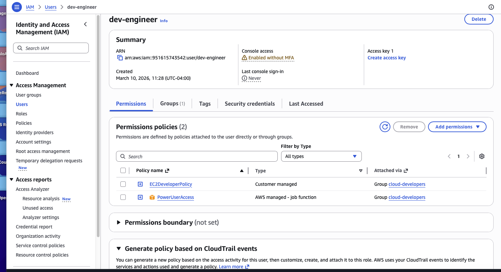
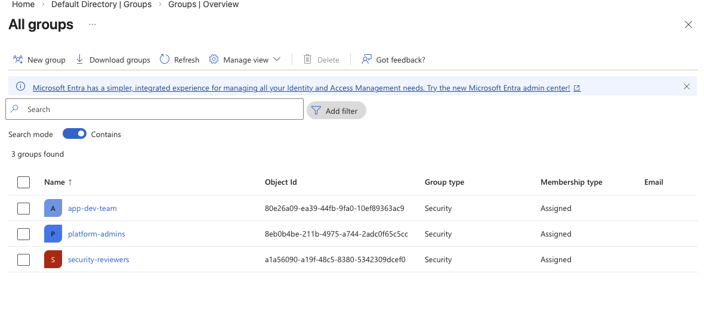
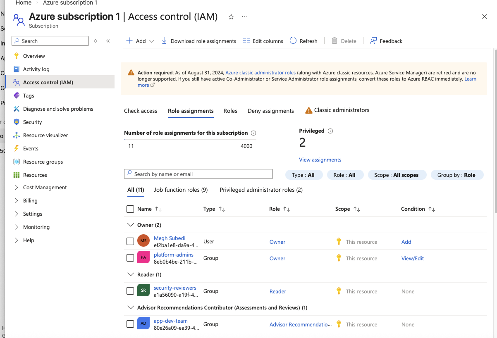
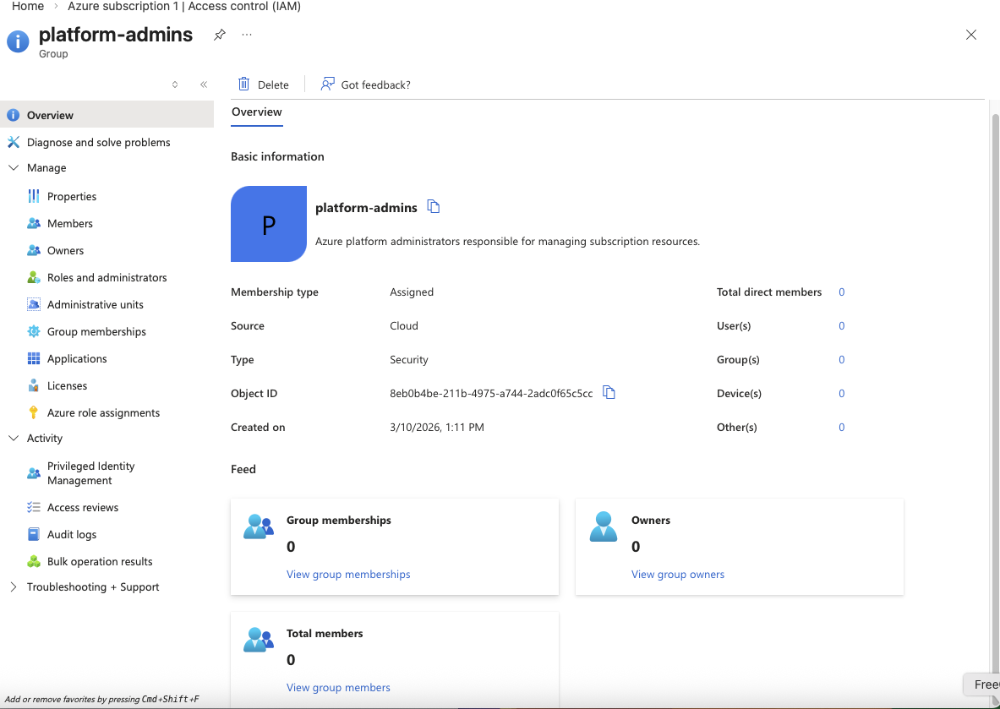
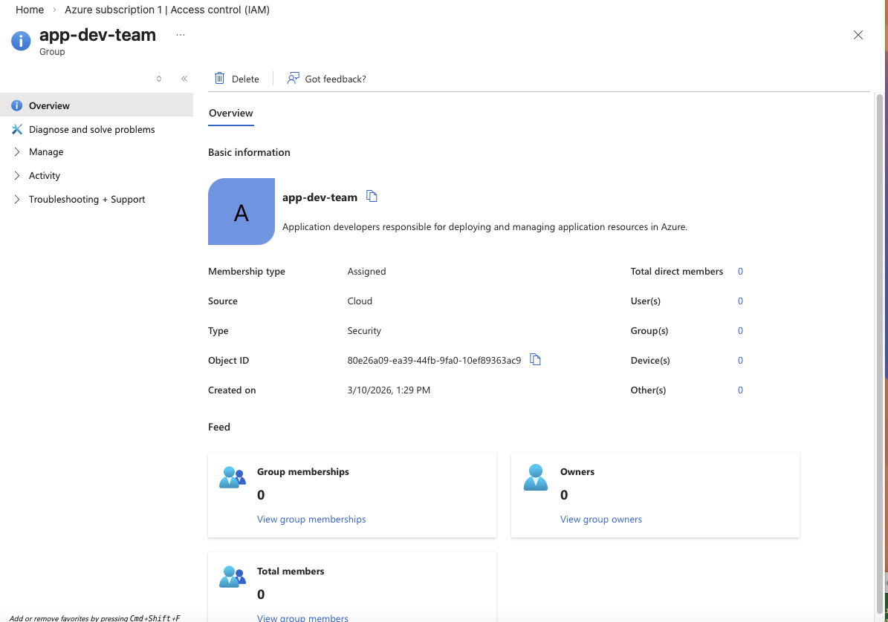

# Multi-Cloud Identity and Access Management (AWS & Azure)

This project demonstrates a **multi-cloud Identity and Access Management (IAM) architecture** implemented across **AWS and Microsoft Azure**. The goal is to showcase how enterprise environments manage identities, permissions, and access control using **Role-Based Access Control (RBAC)** and **least privilege principles**.

---

# Architecture Overview

## AWS IAM Model

| User | Group | Policy |
|-----|------|------|
| cloud-admin | cloud-admins | AdministratorAccess |
| dev-engineer | cloud-developers | PowerUserAccess + EC2DeveloperPolicy |
| security-auditor | security-auditors | SecurityAudit |---

## Azure RBAC Model

User → Group → Role

Example implementation:

platform-admins → Owner  
app-dev-team → Contributor  
security-reviewers → Reader  

Roles were assigned at the **subscription scope** using **Azure RBAC**.

---

# AWS Implementation

Location:

aws/iam-users-groups

Key features implemented:

- IAM users and groups
- AWS managed policies
- Custom EC2 IAM policy
- Role-based permission assignment

Screenshots:

screenshots/aws-iam-users-groups

---

# Azure Implementation

Location:

azure/rbac

Key features implemented:

- Microsoft Entra ID groups
- Azure RBAC role assignments
- Subscription-level access control
- Separation of duties

Screenshots:

screenshots/azure-rbac

---

# Security Principles Demonstrated

## Role Based Access Control (RBAC)

Permissions are assigned to **groups instead of users**, making access easier to manage.

User → Group → Role / Policy

---

## Least Privilege

Users receive **only the permissions required** to perform their tasks.

Example:

- Developers → Contributor access
- Security team → Reader access

---

## Separation of Duties

Three operational roles were created:

Admin  
Developer  
Security / Audit  

Each role has different levels of access.

---

# Tools & Platforms

- AWS IAM
- Microsoft Entra ID
- Azure RBAC
- Git
- GitHub

---

# Project Purpose

This project demonstrates how **multi-cloud IAM architectures are designed and implemented in real enterprise environments**.

It highlights:

- cloud security fundamentals
- identity governance
- cross-platform RBAC models

---
# AWS Implementation

This section demonstrates IAM users, groups, and policies.

# AWS IAM Implementation Screenshots

### IAM Groups Overview

### Developers Group Permissions

### Security Auditors Permissions

### Custom EC2 IAM Policy

### User Group Membership

---

# Azure Implementation

This section demonstrates Azure RBAC groups and role assignments.

# Azure RBAC Implementation Screenshots

### Entra ID Groups

### Role Assignments Overview

### Owner Role Assignment

### Reader Role Assignment

---
